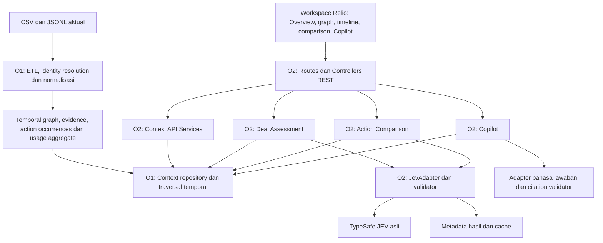
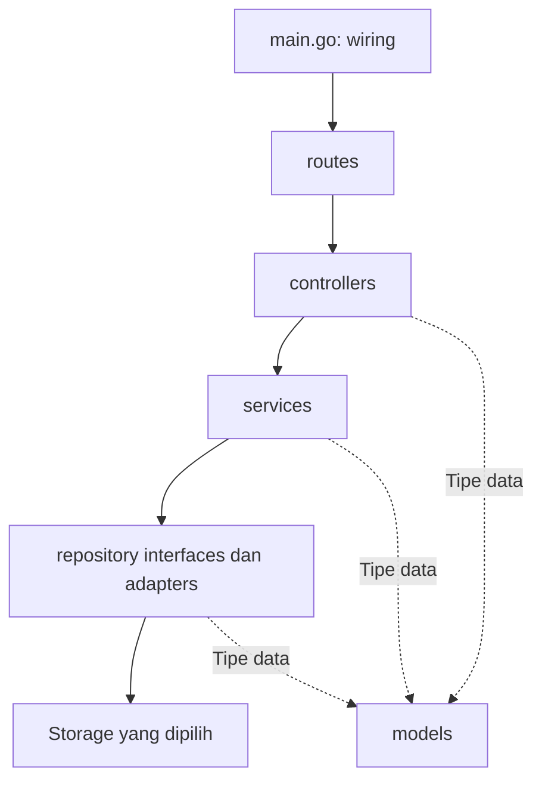
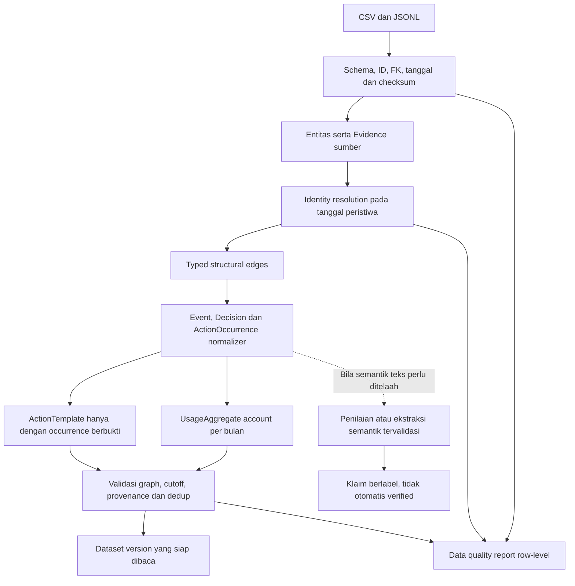
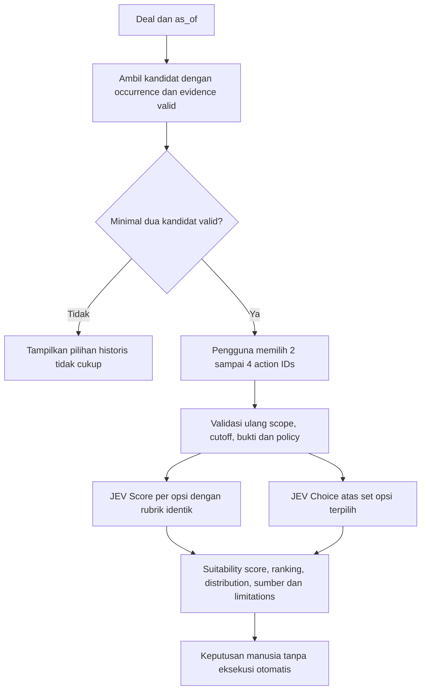

# Relio — Arsitektur Backend Berdasarkan PRD Final MVP v1.0

**Tanggal:** 9 Oktober 2026  
**Status:** Baseline kebutuhan v1; bukan laporan implementasi selesai.  
**Cakupan:** Backend Go, Temporal Context Graph, assessment, perbandingan tindakan historis, dan Copilot.  
**Dokumen pendamping:** [Pertanyaan terbuka](open-questions.md) · [Rencana pengembangan dua orang](development-plan.md).

> Relio membantu memahami deal dan membandingkan pendekatan yang memiliki preseden nyata. Skor kesesuaian bukan probabilitas closing. Sales/VP Sales memutuskan sendiri; Relio tidak menyetujui diskon atau menjalankan tindakan komersial.

## 1. Sumber acuan dan status keputusan

### 1.1 Hierarki source of truth

1. [PRD Final MVP v1.0](../../Relio_PRD_Final_MVP_v1.0_Agent_Ready_ID.md): scope P0, aturan bisnis, rubrik, kontrak semantik, dan DoD.
2. CSV/JSONL aktual serta [kamus dataset KasirNusa](../../HACKATHON%20PENS%202026/dataset_kasirnusa/README.md): schema dan catatan faktual. Angka/konteks audit PRD tetap diverifikasi terhadap sumber.
3. Dokumen arsitektur dan keputusan teknis yang disahkan: penerjemahan kebutuhan ke batas komponen.
4. Kontrak API, migration, prompt/rubrik, serta test: spesifikasi eksekusi yang harus konsisten dengan acuan di atas.

**v1 menggantikan seluruh PRD v0.1–v0.4 dan Technical Build Spec untuk pekerjaan MVP.** Dokumen lama hanya referensi sejarah. Perbandingan tindakan berbukti sekarang P0; ini bukan izin menghidupkan kembali action optimizer, portfolio comparator, atau simulasi uplift.

PRD masih menunjuk `READMEHack.md`, tetapi file tersebut belum ditemukan dalam audit yang mendasari dokumentasi ini. Kamus dataset yang tersedia dipakai sementara; konfirmasi penggantinya pada Q24.

### 1.2 Arti label

| Label | Arti |
|---|---|
| **Ditetapkan** | Persyaratan v1 atau instruksi proyek yang sudah disepakati. |
| **Ada di kode** | Terlihat pada scaffold; bukan klaim build/runtime test lulus. |
| **Turunan kebutuhan** | Tanggung jawab logis untuk memenuhi PRD; nama struct/file belum dikunci. |
| **Default bersyarat PRD** | Pilihan awal v1 untuk repo kosong/ketika feasible; bukan migrasi otomatis. |
| **Terbuka** | Detail belum ditentukan; rekomendasi berada di `open-questions.md`. |

Dokumen ini memuat baseline dan keterbatasannya. Rekomendasi teknologi/implementasi tidak otomatis menjadi keputusan final.

## 2. Register keputusan yang sudah ditetapkan

| ID | Keputusan | Dasar | Dampak |
|---|---|---|---|
| D01 | Unit utama adalah Deal dengan `deal_id`; P01–P05 adalah akun. | PRD §2–3 | Scope query/assessment/comparison menggunakan deal, bukan menyamakan ID akun dan deal. |
| D02 | Lima prospek P01–P05 dan deal terkait menjadi overview MVP. | PRD §6, §12 | Data berasal dari sumber, bukan respons demo hardcoded. |
| D03 | Graph temporal adalah model relasi utama dan fitur interaktif. | PRD §3 | Typed nodes/edges, traversal, event, provenance; bukan satu tabel agregat. |
| D04 | Graph, timeline, evidence, assessment dan comparison konsisten pada `as_of`. | PRD §3, §12 | Tidak ada fakta masa depan atau panel snapshot campuran. |
| D05 | Batas maksimum dataset adalah `2026-10-01`. | PRD header, §2, §7 | Cutoff diketahui; timezone/inklusivitas tetap Q03. |
| D06 | Empat keluaran deal: attractiveness, urgency, readiness, evidence coverage. | PRD §4 | Tidak disatukan menjadi probabilitas Won. |
| D07 | Rubrik memiliki versi dan tidak dikonfigurasi Sales. | PRD §1, §4, §14 | Tidak ada slider/endpoint mengubah bobot pengguna. |
| D08 | Overview mengurutkan urgency diketahui tertinggi; null masuk kelompok Data belum memadai. | PRD §6.1 | Null bukan prioritas rendah; tie-break/detail sort Q18. |
| D09 | JEV asli wajib, server-side, dengan bukti hasil retrieval graph. | PRD §4, §12 | Adapter, validasi, cache, metadata, dan kegagalan nyata. |
| D10 | Copilot read-only berbukti adalah P0. | PRD §6.5, §12 | Citation nyata atau abstention; pertanyaan baru, bukan jawaban hafalan. |
| D11 | Fakta sumber, hasil hitung, penilaian model dan ketidakpastian dibedakan. | PRD §3–4 | Model tidak otomatis membentuk fakta/edge verified. |
| D12 | Requested, proposed, approved, rejected dan applied tidak disatukan. | PRD §3.4, §5.4 | Tidak ada pewarisan izin permintaan lama ke permintaan baru. |
| D13 | Diskon `>10%` memerlukan VP Sales approval; reference consent tidak diasumsikan. | PRD §5.4 | Tampilkan policy flags, bukan menerbitkan persetujuan. |
| D14 | Usage pelanggan existing hanya konteks pembanding prospek. | PRD §2, §4 | Bukan usage prospek, profit, kepuasan, atau consent. |
| D15 | Tidak ada action eksternal/approval bisnis otomatis dalam MVP. | PRD §1, §5 | Comparison membantu keputusan, tidak mengirim email atau mengubah CRM/billing. |
| D16 | Go dan package langsung di bawah `backend/`; `main.go` di `backend/`. | Instruksi proyek | Tanpa `internal/` dan `cmd/`. |
| D17 | Package: routes, controllers, services, repository, models. | Instruksi proyek | HTTP, business logic dan akses data terpisah. |
| D18 | Antarmuka aplikasi adalah REST JSON. | PRD §8, struktur backend | Frontend tidak menjalankan query database atau memakai secret JEV. |
| D19 | Setiap ActionTemplate mempunyai minimal satu ActionOccurrence berbukti. | PRD §5.1 | Katalog hanya berasal dari tindakan/usulan yang tercatat. |
| D20 | Pengguna memilih 2–4 opsi; Score per opsi dan Choice antaropsi dipisahkan. | PRD §5 | Kurang dua opsi valid tidak menghasilkan comparison palsu. |
| D21 | Experiment kit Unguided/Graph-Guided/AI-Guided adalah P0. | PRD §10, §12 | Ground truth manual; hasil peserta tidak boleh direkayasa. |
| D22 | Dua fokus pengembangan: O1 context graph/data, O2 aplikasi backend. | Instruksi proyek terbaru | Batas kerja dan handoff ada pada rencana pengembangan; tidak mengharuskan microservice. |

Sales/VP menggunakan informasi untuk mengambil keputusan. Role/login belum dipilih. Penolakan satu permintaan diskon tidak otomatis membuat urgency/prioritas seluruh deal menjadi nol. Riwayat persetujuan bukan approval workflow baru.

## 3. Scope MVP v1

| P0 | Kemampuan wajib |
|---|---|
| P0-01 | Audit sumber, import ulang konsisten, data-quality report. |
| P0-02 | Deal-centric Temporal Context Graph, identity resolution, provenance dan `as_of`. |
| P0-03 | Timeline ↔ graph ↔ evidence viewer tersinkronisasi. |
| P0-04 | Overview prioritas, empat assessment, penjelasan dan unknowns. |
| P0-05 | Live JEV, response terstruktur, validasi, cache dan error state. |
| P0-06 | Katalog serta comparison 2–4 tindakan historis dengan preseden/policy flags. |
| P0-07 | Copilot berbukti dan abstention. |
| P0-08 | Unit/integration/E2E, experiment kit dan test report aktual. |

**Di luar MVP:** konfigurasi bobot Sales, optimizer portofolio/deal–action, causal uplift, calibrated Won/Lost dari dataset kecil, CLV/profit, Monte Carlo, GNN, tindakan tanpa preseden, CRM enterprise, multi-tenant production auth, approval bisnis baru dan external writes otomatis.

P0-06 adalah **perbandingan kesesuaian**, bukan optimasi resource/kapasitas dan bukan simulasi outcome alternatif.

## 4. Kondisi implementasi saat dokumentasi diperbarui

| Area | Ada di kode | Belum ada |
|---|---|---|
| Server | [main.go](../main.go), stdlib `net/http`, `ADDR` default `:8080`, graceful shutdown. | Wiring graph/storage/model/Copilot. |
| Routes | [routes/routes.go](../routes/routes.go), `GET /healthz`. | Route `/api/...` v1. |
| Health | Controller/service dengan respons statis `ok`. | Dataset/graph readiness dan status integrasi model nyata. |
| Deal | [models/deal.go](../models/deal.go), [DealService](../services/deal_service.go), [DealRepository](../repository/deal_repository.go). | Adapter data, timeline, graph, assessment. |
| Actions | Belum ada modul katalog/comparison. | ActionTemplate, ActionOccurrence, candidates, Score/Choice comparison. |
| Test | File test route dan DealService tersedia. | Integrasi dataset, temporal, live JEV, comparison, Copilot, E2E. |
| Dependensi | [go.mod](../go.mod): Go 1.22, module `github.com/nopaalh/Relio/backend`; stdlib server. | Driver graph, Gin bila diputuskan, provider model/auth. |

`DealRepository` hanya kontrak `List(ctx, asOf)`/`FindByID(ctx, dealID, asOf)`; `DealService` mendelegasikan dan memvalidasi ID. Model scalar saat ini belum memenuhi kebutuhan null/unknown untuk semua field target.

Status di atas berasal dari inspeksi source, bukan build/test success. Pembaruan ini hanya dokumentasi; tidak mengimplementasikan komponen target.

## 5. Komponen software dan alur data

Nama komponen berikut adalah pemetaan tanggung jawab, bukan kesepakatan nama file/struct atau jumlah server.



O1 menyediakan **context yang benar**, O2 menyajikan dan menilai context tersebut. Physical storage graph/evidence/cache belum dikunci (Q01). Tidak ada kebutuhan final untuk broker, vector database, Kubernetes, atau dua API server.

O1/O2 adalah fokus backend. Kepemilikan frontend visual/E2E tetap perlu diputuskan; graph API yang selesai **bukan** bukti UI graph interaktif selesai (Q29).

## 6. Package, dependency dan ownership

```text
backend/
├── main.go
├── go.mod
├── README.md
├── routes/
├── controllers/
├── services/
├── repository/
├── models/
└── docs/
    ├── architecture.md
    ├── open-questions.md
    └── development-plan.md
```

| Lokasi | Tanggung jawab | Batas |
|---|---|---|
| `main.go` | Config, dependency wiring, startup/shutdown. | Tidak parsing dataset atau menulis rubrik inline. |
| `routes` | Route dan middleware. | Tidak query storage/model. |
| `controllers` | HTTP parsing, request validation, response/error. | Tidak SQL/Cypher atau menentukan score. |
| `services` | Domain policy, context orchestration, assessment, comparison, Copilot. | Tidak bergantung pada HTTP response writer. |
| `repository` | Interface, adapter storage, traversal temporal, persistensi sumber/cache. | Tidak memutuskan kesiapan/approval komersial. |
| `models` | Domain graph/event/evidence/action dan DTO aplikasi. | Tidak I/O atau panggilan vendor. |



- Interface dan DTO dipisahkan dari query khusus engine; frontend tidak bergantung pada engine graph.
- `repository` tidak bergantung pada controller/service; hindari dependency cycle.
- `context.Context`, timeout dan cancellation diteruskan ke I/O yang relevan.
- Client model server-side dapat diuji tanpa memanggil model pada setiap unit test; mock bukan penerimaan live integration.
- O1 mengerjakan graph/source model dan adapter baca; O2 aplikasi/HTTP/model/cache. Folder bersama tidak berarti kedua orang bebas mengubah file yang sama.
- Nama file, interface handoff dan ownership migration dipastikan pada Q30 serta [development-plan.md](development-plan.md).

## 7. Dataset dan importer

Sumber lokal: `HACKATHON PENS 2026/dataset_kasirnusa/`, di-ignore oleh Git. Clone repositori tidak otomatis menyediakan dataset.

| Sumber P0 | Relasi/fungsi | Batas interpretasi |
|---|---|---|
| `crm_deals.csv` | Deal→Account/owner, stage, ACV, outlet. | Potensi nilai, bukan revenue; stage snapshot bukan seluruh stage history. |
| `crm_accounts.csv` | Account, industri, owner/champion, jumlah outlet. | Prospek: rencana outlet; current champion tidak otomatis berlaku historis. |
| `crm_contacts.csv` | Contact ID, email/jabatan sekarang. | Bukan daftar semua email/jabatan historis. |
| `contact_employment_history.csv` | Person→Account/organisasi dengan `mulai/selesai`. | Riwayat kerja membantu identitas; kolom yang diperiksa tidak memberi semua email lama. |
| `employees.csv` | Owner, peserta internal, approver. | Role snapshot tidak membuktikan role pada semua tanggal lampau. |
| `interactions.jsonl` | Actor/recipient/participant/thread, event/action/intent evidence. | `deal_id` tidak langsung tersedia pada schema; account-only tidak dipaksa ke deal. |
| `decision_log.csv` | Keputusan/approval, preseden, nilai, interaksi sumber. | Deal/link bukti boleh kosong; keputusan akun lain bukan izin deal aktif. |
| `contracts_billing.csv` | Kontrak, diskon applied, decision link bila tersedia. | Account join saja tidak membuktikan penerapan request tertentu. |
| `outlets.csv` | Outlet→Account untuk agregasi usage. | Node Outlet opsional; mapping sumber tetap dibutuhkan. |
| `product_usage_daily.csv` | Transaksi harian → account/month aggregate. | Bukan rupiah, profit, kepuasan, atau usage prospek. |
| `feature_usage_monthly.csv` | Adoption fitur pada existing customer. | Resolusi bulanan dan cutoff parsial perlu aturan. |

**Opsional setelah P0 stabil:** support tickets, features, bugs dan releases ketika relevan. Jangan menyatakan masalah produk terbukti bila bukti pengayaan yang diperlukan belum tersedia.

### 7.1 Pemetaan nyata yang sudah diperiksa

| Account | Deal | Stage CSV | Potensi ACV | Outlet deal |
|---|---|---|---:|---:|
| P01 | DL-001 | Proposal | Rp252.000.000 | 60 |
| P02 | DL-002 | Demo | Rp63.000.000 | 15 |
| P03 | DL-003 | Discovery | Rp37.800.000 | 9 |
| P04 | DL-004 | Negosiasi | Rp147.000.000 | 35 |
| P05 | DL-005 | Lead | Rp168.000.000 | 40 |

Ini berasal dari `crm_deals.csv` yang diperiksa, bukan skor model atau rekonstruksi semua tanggal. Normalisasi enum harus eksplisit; sumber memakai `Negosiasi`. Konflik `crm_deals.outlet` versus `crm_accounts.jumlah_outlet` dicatat, tidak dipilih diam-diam.

### 7.2 Pipeline



Edge struktural dari `account_id`, `owner_id`, `contact_id`, peserta, `decision_id` dan rentang employment dibentuk deterministik. LLM tidak diperlukan untuk memahami bahwa DL-002 milik P02. Teks bebas tentang syarat signing/aksi memerlukan interpretasi berbukti; keberadaan kolom CSV tidak menyelesaikan seluruh makna.

O1 menyediakan mapping sumber, excerpt/span dan aturan ekstraksi. O2 memiliki satu adapter JEV untuk penilaian aplikasi. Jika semantic enrichment graph memakai adapter itu, provenance dan validasinya tetap dijaga; jangan membuat dua client/rubrik berbeda untuk klaim yang sama (mekanisme Q25/Q30).

### 7.3 Invariant import

- Log jumlah/checksum, cek FK, validasi tanggal dan cutoff. Angka audit PRD bukan hasil yang di-hardcode.
- Semua error row-level dilaporkan pada artefak `reports/data_quality.md`; lokasi kerja/output final disepakati pada Q24.
- Reimport dua kali menghasilkan ID/jumlah graph sama dan tidak menggandakan agregat.
- Event proyeksi Decision/Interaction tidak dihitung sebagai dua fakta independen.
- Satu record boleh mendukung beberapa klaim; setiap klaim menunjuk field/span tepat.
- ID tidak dibentuk dari nama, nomor baris semata, atau narasi LLM yang berubah-ubah (Q07).
- Fixture terpisah dari data kompetisi. Import parsial tidak disebut ready (Q24).
- Data struktural dapat dibangun sebelum model tersedia; MVP penuh tetap memerlukan live JEV.

## 8. Model graph dan provenance v1

### 8.1 Node minimum

| Node | Makna/properti inti |
|---|---|
| `Deal` | ID, account, stage snapshot, ACV, owner, status. |
| `Account` | Identitas pelanggan/prospek dan konteks faktual. |
| `Person` | Subtipe Employee/Contact, ID sumber, identity yang memang diketahui. |
| `Interaction` | ID, tanggal, tipe, subject, participant IDs, reply/thread reference. |
| `Event` | ID stabil, `event_at`, `event_type`, status, summary, evidence, verification. |
| `Decision` | ID, tanggal, tipe, hasil/nilai, approver, evidence, nullable deal. |
| `ActionOccurrence` | Tindakan/usulan historis, actor, targets, waktu, nullable outcome, evidence. |
| `Evidence` | ID, file/record, source field/span, source date dan excerpt. |
| `Contract` | Ketentuan yang tercatat, nilai/diskon, periode dan decision link. |
| `UsageAggregate` | Account/month, transaksi, outlet aktif unik, feature metric bila tersedia, sumber agregasi. |

Outlet boleh dimaterialisasikan untuk konteks; 226 ribu transaksi harian bukan node individual. `ActionTemplate` adalah model katalog yang diwajibkan §5; representasi fisiknya sebagai node/record dan hubungan ke occurrence masih Q25. Node Assessment/Buyer request tambahan juga perlu schema eksplisit, bukan asumsi otomatis.

### 8.2 Edge minimum

| Edge | Makna |
|---|---|
| `DEAL_OF_ACCOUNT`, `OWNED_BY` | Deal→Account dan owner internal berdasarkan sumber. |
| `WORKED_AT` | Person→organisasi/account dengan validity interval. |
| `SENT`, `ADDRESSED_TO`, `PARTICIPATED_IN` | Pengirim, penerima dan peserta yang dapat diidentifikasi. |
| `CONCERNS_DEAL`, `CONCERNS_ACCOUNT` | Scope deal dan akun tidak disamakan. |
| `ACTOR_OF`, `DIRECTED_TO` | Pelaku dan sasaran event/action. |
| `RESULTED_IN` | Link hasil yang terdokumentasi; endpoint/detail schema Q09, bukan bukti kausal universal. |
| `REQUESTED_IN`, `DECIDED_BY` | Permintaan dan pengambil keputusan berbukti. |
| `SUPPORTED_BY` | Klaim/event/action/decision → Evidence. |
| `HAS_CONTRACT`, `HAS_USAGE`, `HAS_OUTLET` | Kontrak/agregat/outlet akun. |
| `SIMILAR_PRECEDENT` | Kemiripan preseden berlabel inferred, bukan izin atau kausalitas. |

Nama current v1 adalah `SIMILAR_PRECEDENT`, bukan nama baseline v0.4. Arah fisik/link request, thread, ActionTemplate→Occurrence dan source projection diputuskan pada Q09/Q25; daftar minimum belum merupakan DDL lengkap.

### 8.3 Metadata dan kategori event

Edge penting menyimpan `edge_id`, `valid_from/to`, `observed_at` **jika tersedia**, `source_record_ids`, `evidence_ids`, `verification_state` (`verified`, `inferred`, `ambiguous`) dan metode pencocokan. File/record/field/span sumber dapat ditelusuri melalui Evidence. Jangan mengarang timestamp atau confidence terkalibrasi.

Pisahkan sifat klaim (fakta sumber/hasil hitung/penilaian model), verification state, business status, dan availability seperti unknown/snapshot-only. Exact claim/availability DTO masih Q09/Q18; vocabulary lama tidak otomatis menjadi enum wajib v1.

Kategori event minimum v1:

```text
OUTBOUND_EMAIL, INBOUND_EMAIL, MEETING, BUYER_REQUEST, FOLLOW_UP,
PROPOSAL, PILOT_OFFER, DISCOUNT_REQUEST, COMMERCIAL_DECISION,
CONTRACT_TERM, CONTACT_TRANSITION, PRODUCT_REQUIREMENT, OTHER, UNCLEAR
```

Kategori tidak memerintahkan pembuatan event jika sumber tidak ada. Jangan menamai email sebagai DISCOUNT_REQUEST/PILOT_OFFER tanpa bukti. Filter tipe/aktor/status serta pemetaan event↔node/edge/evidence diperlukan untuk interaktivitas.

## 9. Temporal correctness

| Waktu | Makna/batas |
|---|---|
| `event_at` | Waktu peristiwa menurut sumber; filter event terhadap snapshot. |
| `recorded_at` | Saat informasi dicatat/diketahui, hanya jika sumber menyediakannya. |
| `valid_from/to` | Masa berlaku pekerjaan/relasi/ketentuan. |
| `observed_at` | Metadata sumber jika tersedia; bukan otomatis ingestion time. |
| Ingestion time | Metadata operasi import, bukan waktu pengetahuan historis. |

Tanpa recorded time, baseline adalah rekonstruksi **kejadian**, bukan audit bitemporal tentang apa yang telah diketahui organisasi saat itu.

Invariant:

1. `event_at > as_of` tidak muncul atau memengaruhi assessment/comparison/Copilot.
2. Resolve peserta berdasarkan pekerjaan pada waktu event; tampilan pekerjaan aktif berdasarkan `as_of`. Histori tetap dapat dibuka dengan label periode.
3. Current stage tidak diisi retroaktif. Sebelum snapshot dan tanpa sejarah, `stage_as_of = unknown`; snapshot-only attributes ditandai `snapshot_only` atau disembunyikan.
4. ACV/owner/champion/status current juga tidak otomatis dianggap berlaku sejak deal dibuat.
5. Account-only decision/interaksi tidak dipromosikan menjadi fakta deal tertentu.
6. Approval lama tidak berlaku otomatis pada request baru.
7. Usage dan feature monthly aggregate mengikuti cutoff/coverage, tidak memakai bulan penuh untuk tanggal parsial tanpa rule.
8. Preseden/candidate action memakai occurrence yang valid pada snapshot; template yang hanya dibuktikan oleh tindakan sesudah snapshot tidak boleh bocor ke katalog historis.
9. Evidence, reply thread dan chat history menerapkan scope/waktu yang sama. Jawaban lama bukan source evidence bagi snapshot baru.
10. Rencana renewal bertanggal future berbeda dari event renewal yang sudah berlangsung; availability sumber historis harus dijelaskan.

Timezone, interval boundary, revision dan partial-month policy masih Q03–Q08. Perubahan deal/tanggal harus memperbarui context panel bersama; stale model response tidak menimpa snapshot baru (Q18–Q20).

## 10. Context handoff O1 → O2

**Turunan kebutuhan:** O2 tidak boleh membangun ulang join/identity/temporal traversal versi lain dari CSV mentah. O1 menyediakan query context melalui boundary repository/adapter; O2 membentuk DTO, policy dan assessment aplikasi.

Minimum informasi yang perlu disepakati:

- Scope deal/lintas deal, `as_of`, dataset/evidence version dan limitations.
- Fakta nullable dengan sumber dan availability, bukan missing→zero.
- Nodes/edges/events ber-ID stabil dan mapping highlight.
- Evidence record/excerpt/date/field yang dapat dibuka.
- Request/decision/contract links dengan verification dan scope.
- ActionTemplate/Occurrence/candidate/precedent bundle tanpa future leakage.
- Unknowns, ambiguity, truncation/coverage dan error distinctions.

Nama interface/method/DTO bukan keputusan final PRD; rancangan awal, owner file dan acceptance handoff ada pada [rencana pengembangan](development-plan.md), Q30. Model fixtures untuk paralel development harus diberi label test; bukan data yang disajikan sebagai hasil import asli.

## 11. Evidence dan pengamanan negosiasi

Panel evidence tetap diperlukan karena graph merupakan representasi normalisasi. “Buka sumber asli” berarti membuka cuplikan source record **di dalam Detail Deal**, bukan wajib membaca seluruh CSV/PDF di luar aplikasi.

Tampilkan source ID/file/field/span, tanggal, excerpt yang mendukung, scope, status, event/edge/action references, serta model/rubric metadata bila relevan. Sanitasi tanpa menghilangkan makna; jangan menggabungkan future replies menjadi excerpt snapshot lampau.

Negosiasi:

- `requested`, `proposed`, `approved`, `rejected`, `applied` adalah seri status yang berbeda.
- ActionOccurrence juga dapat memuat `offered`/`completed` sesuai sumber; mapping lintas vocabulary perlu Q25, bukan di-collapse ke approved.
- Persetujuan 10% tidak mengizinkan permintaan baru 14%; selisihnya empat **poin persentase**.
- `>10%` menimbulkan flag kebutuhan VP approval, bukan menghasilkan approval.
- ≤10% tidak memicu ambang khusus itu, tetapi tidak membuktikan bebas seluruh kewajiban lain.
- Applied hanya berdasarkan billing/kontrak yang cocok; preseden akun lain bukan persetujuan untuk deal aktif.
- Tidak ada bukti ≠ kejadian tidak pernah berlangsung.
- Kandidat reference ≠ consent; penggunaan tinggi ≠ kepuasan.

Fixture 10%→14% harus berlabel DATA UJI dan terpisah dari P02 asli. Owner fixture/expected links adalah O1; pemeriksaan policy serta respons aplikasi O2.

Route evidence belum menuliskan `as_of` dalam tabel v1. Binding ke snapshot/access harus dipastikan pada Q19, bukan dianggap evidence bebas waktu.

## 12. Deal assessment v1

### 12.1 Fitur deterministik

PRD §4.2 menetapkan: `annual_potential_idr`, `planned_outlets`, `large_account_fit`, `stage_age_days`, `last_documented_contact`, `explicit_deadline`, `approval_required`, `approval_status`, `analogue_usage`.

ID/nilai/tanggal dibaca deterministik. Interpretasi meaningful interaction/gate tetap memerlukan rule dan bukti. Konflik jumlah outlet dilaporkan; angka tidak direka untuk melengkapi score.

### 12.2 Attractiveness

```text
acv_relative = clamp(100 × acv / max(acv prospek aktif pada snapshot), 0, 100)
strategic_outlets = 100 jika planned_outlets > 30
strategic_outlets = 0 jika diketahui <= 30
strategic_outlets = null jika tidak diketahui
attractiveness = 0.5 × acv_relative + 0.5 × strategic_outlets
```

Kedua komponen wajib diketahui; missing → null/N/A, bukan renormalisasi. Tampilkan denominator dan populasi/version. Populasi **prospek aktif pada snapshot** sudah ditentukan; historical membership, denominator kosong/nol dan rounding masih Q11.

`commercial_context_jev` opsional bila bukti cukup dan tampil sebagai dimensi terpisah, tidak mengubah angka deterministik. Bobot bukan koefisien jurnal; outlet adalah rencana, usage analog bukan performa prospek.

### 12.3 Urgency

| Komponen | Nilai v1 | Bobot |
|---|---|---:|
| Purchase gate | Gate eksplisit belum selesai `100`; keberatan bukan gate yang jelas `40`; resolved berbukti `0`; unknown null. | 0,55 |
| Deadline | Tanggal eksplisit terlewat `100`; mendekat dalam **7 hari** `75`; lebih jauh `25`; tidak diketahui null. | 0,25 |
| Unresolved follow-up | Janji/tugas tertulis jelas tanpa bukti pemenuhan `75`; selesai berbukti `0`; tidak dapat diverifikasi null. | 0,20 |

```text
urgency = sum(weight × nilai komponen known) / sum(weight komponen known)
```

Semua unknown → null; known-zero tetap ikut denominator. Tampilkan kontribusi, effective weight, sumber dan keterbatasan. Stage age bukan pembobot otomatis. Default tujuh hari adalah keputusan engineering v1, **bukan pertanyaan apakah threshold dipakai lagi**; batas tepat hari/aturan multi-signal masih Q12.

JEV blocker-severity menjadi semantic check terpisah. Ketidaksepakatan aturan/JEV diberi label perlu telaah, tidak dirata-ratakan diam-diam.

### 12.4 Readiness

| Level | Label v1 |
|---:|---|
| 0 | `no_evidence_of_intent` |
| 1 | `initial_interest` |
| 2 | `active_evaluation` |
| 3 | `commercial_discussion` |
| 4 | `explicit_commitment_or_final_gate` |

```text
readiness_100 = round(25 × jev_score)
```

Score dapat berupa ekspektasi tertimbang atas lima level, bukan selalu bilangan bulat. Penentuan ordinal label dari distribusi/raw score perlu kontrak Q14. Evidence tidak cukup → null/insufficient_evidence sebelum pemanggilan; bukan dipaksa level 0. Provider error berbeda dari evidence tidak cukup. Tidak ada calibrated P(Closed Won).

### 12.5 Evidence coverage dan penjelasan

Lima dimensi **sudah ditetapkan**: `deal_record`, `stakeholder_context`, `meaningful_interaction`, `commercial_terms`, `decision_or_gate_evidence`.

Laporkan observed/required dimensions, misalnya 3/5; bukan confidence closing. Kriteria known, konflik dan ketiadaan data per dimensi masih Q13, bukan registry lima dimensi yang belum dipilih.

Semua score membuka penjelasan nilai mentah, rubric/version, faktor positif/negatif/unknown, JEV subassessment, evidence dan graph references. Exact version identifiers di kode disepakati; jangan memakai versi rubrik lama sebagai nama current tanpa keputusan.

## 13. Katalog dan action comparison

### 13.1 Katalog berbukti

Setiap ActionTemplate mempunyai minimal satu ActionOccurrence dengan evidence. Nama seperti PILOT_OFFER/REFERENCE_REQUEST/FOLLOW_UP hanya muncul bila ditemukan pada sumber. Usulan tindakan nyata boleh dicatat dengan status aslinya; jangan mengubah offered menjadi completed.

Outcome unknown tetap unknown. “Action dilakukan lalu deal Won” bukan bukti action menyebabkan kemenangan. Preseden kasus lain berlabel `analog_precedent`.

O1 menghasilkan occurrences/template links dan retrieval preseden; O2 memvalidasi request comparison, menjalankan penilaian dan memformat policy/unknowns. Relevance/eligibility aturan bersama pada Q25–Q28; jangan membuat dua candidate filter berbeda.

### 13.2 Perjalanan comparison



`GET candidates` tidak otomatis berarti siap dieksekusi. Tindakan dapat `requires_validation`, consent unknown atau membutuhkan VP approval. Action ID dari browser divalidasi kembali terhadap context saat comparison, termasuk cutoff presedennya.

### 13.3 Rubrik dan probabilitas

| Level | Action Suitability |
|---:|---|
| 0 | `unsupported_or_mismatched` |
| 1 | `weak_match` |
| 2 | `partial_match` |
| 3 | `strong_match` |
| 4 | `directly_addresses_explicit_gate` |

`suitability_score_100 = round(25 × jev_score)`. Setiap opsi dinilai memakai rubrik yang sama; score bukan softmax terhadap opsi lain.

Choice menghasilkan `jev_action_preference_distribution` atas 2–4 opsi terpilih. Itu preferensi relatif model, bukan peluang closing. Set yang berbeda tidak dibandingkan sebagai probabilitas absolut. Jika Choice dan Score berbeda urutan, tampilkan keduanya/perlu telaah. Ranking/tie/partial-result detail masih Q27; Noul relevansi action adalah tambahan opsional.

Hasil memuat raw/normalized score, ranking, distribution bila tersedia, evidence/precedent IDs, prerequisites, kelebihan/kendala, policy flags dan unknowns. Penjelasan berasal dari rubrik+bukti, bukan alasan internal JEV yang dikarang.

## 14. Integrasi JEV dan cache

### 14.1 Fungsi aplikasi wajib

| Fungsi lokal Relio | Tugas |
|---|---|
| `assess_buying_signal` | Choice: interest/objection/commitment/unclear. |
| `classify_blocker` | Choice: price/reference/stakeholder/product/process/none_explicit/unclear. |
| `assess_readiness` | Score ordinal lima tingkat. |
| `assess_blocker_severity` | Score ordinal lima tingkat. |
| `confirm_explicit_gate` | Noul proposisi sempit dengan kutipan. |
| `assess_action_suitability` | Score tiap opsi dari deal+action evidence bundle. |

Choice preferensi antaropsi juga P0 §5.3. Nama fungsi di atas milik aplikasi, bukan method SDK Go.

### 14.2 Kontrak yang disebut PRD vs bukti live

PRD menyebut `POST https://api.typesafe.ai/v1/systemone`, Bearer `TYPESAFE_API_KEY`, model `jev-latest`, `state`, map `questions`, tipe choice/score/noul, dan `answers.*`.

**Ini kontrak yang dinyatakan dokumen, bukan laporan verifikasi live pada repo.** O2 harus mengecek dokumentasi resmi dan melakukan POC autentik sejak awal (Q15): https://docs.typesafe.ai/api, https://docs.typesafe.ai/primitives, https://docs.typesafe.ai/patterns/composite-scoring.

Tidak mengirim seluruh raw dataset. Bundle berisi source IDs, quote/date/type, relasi/verifikasi dan fakta numerik relevan. Input kosong tidak menghasilkan tebakan.

Validasi bentuk/schema/enum, level/rentang, distribusi Choice/Score berjumlah sekitar satu sesuai tolerance yang disepakati, dan evidence/scope/time. Structured output bukan jaminan kebenaran; unsupported claim tidak menjadi edge verified (Q16).

### 14.3 Metadata, cache dan failure

Simpan model/rubric/question version, evidence IDs, as_of, response status, latency, cache key, token usage bila tersedia dan hasil validasi. Jangan mengarang metadata yang provider tidak mengembalikan.

Cache v1 berdasarkan **hash input bundle + versi pertanyaan + model + snapshot**. Input comparison mencakup set action IDs dan bukti masing-masing; tidak menggunakan Choice cached dari set berbeda. Detail canonical hashing, version invalidation, retention, access scope dan async masih Q20/Q27.

API gagal → unavailable/not_evaluated yang terlihat, bukan mock live. Skor deterministik valid tidak perlu hilang karena outage JEV. Retry/rate/cost limit diperlukan tanpa paid-call loop; mekanisme Q20/Q22.

## 15. Copilot

Copilot memakai retrieval graph/evidence untuk deal dan konteks lintas deal yang diizinkan. LLM generatif boleh merangkai bahasa jawaban; JEV tetap menangani penilaian terstruktur. Provider generatif belum dipilih.

- Pertanyaan parafrasa baru, evidence IDs nyata, graph paths yang valid, unknowns dan abstention.
- Tidak mengarang approval/consent/closing probability/uplift.
- Preseden akun lain tidak menjadi fakta atau izin deal aktif.
- Citation harus benar-benar ada dalam bundle dan valid untuk waktu/akses.
- Source text adalah data, bukan instruksi; prompt injection tidak mengubah akses/tool policy.
- Conversation/history bukan sumber faktual baru. Saat deal/as_of/user berubah, evidence jawaban berikutnya tetap harus tervalidasi terhadap context baru.
- Jika membahas comparison, jawaban menggunakan hasil tervalidasi dan set opsi yang jelas, bukan menciptakan tindakan tanpa katalog.
- Tidak ada commercial write tool; retrieval/traversal bounded, history ownership dan persistence masih Q17/Q21.

## 16. API v1 dan kompatibilitas

Endpoint target berikut belum diimplementasikan pada scaffold:

| Method | Route v1 | Keluaran |
|---|---|---|
| GET | `/api/deals?as_of=...` | Deal facts, score/status, blocker, action count; null group. |
| GET | `/api/deals/{deal_id}` | Metadata akun/deal dan KPI faktual. |
| GET | `/api/deals/{deal_id}/graph?as_of=...&depth=1` | Nodes, edges, evidence, unknowns, snapshot limitations. |
| GET | `/api/deals/{deal_id}/timeline?as_of=...` | Event kronologis, actor/status/source, graph references. |
| GET | `/api/deals/{deal_id}/assessment?as_of=...` | Empat keluaran dan JEV subassessments/status. |
| GET | `/api/deals/{deal_id}/action-candidates?as_of=...` | Kandidat katalog, occurrence/precedent evidence, policy state. |
| POST | `/api/deals/{deal_id}/actions/compare` | Suitability/rank/Choice distribution, bukti dan limitations. |
| GET | `/api/evidence/{evidence_id}` | Excerpt/provenance aman. |
| POST | `/api/copilot/ask` | Jawaban/citations/evidence paths/unknowns. |
| GET | `/api/health` | Layanan lokal, dataset, graph, JEV config/integration status tanpa secret. |

Request comparison memuat `as_of` dan 2–4 `action_ids`. Hasil memiliki `comparison_type = action_suitability_not_win_probability`, assessment status, rubric version dan items; null bukan hasil sukses yang dibuat-buat.

Route `/summary`, `/events`, `/copilot/query` dari v0.4 bukan kontrak baru. Endpoint khusus discount-history tidak dicantumkan v1, tetapi fungsi negosiasi tetap tersedia pada timeline/evidence/policy context. Compatibility alias hanya bila ada consumer nyata; saat ini route tersebut belum ada.

Detail/evidence tidak menuliskan `as_of` pada tabel PRD; binding historical context tetap wajib diputuskan, bukan alasan membocorkan future facts (Q18/Q19). Focus event support tetap diperlukan walau contoh graph sekarang memakai depth.

Bekukan OpenAPI sebelum frontend integration: null/error/pending, unknown action, jumlah opsi invalid, missing deal, invalid as_of, retrieval kosong, truncation dan JEV failure. HTTP tidak boleh menyajikan success palsu. `/healthz` existing tetap scaffold statis; hubungan liveness/readiness Q24.

## 17. Teknologi, konfigurasi dan keamanan

### 17.1 Default bersyarat PRD

Untuk repo kosong, v1 mengarahkan Next.js/TypeScript, Go/Gin, Python ETL, Neo4j Community via Docker bila feasible. Solusi existing yang stabil/setara dipertahankan; jangan migrasi stack besar tanpa alasan.

Repo ini sudah memiliki Go stdlib scaffold, belum graph storage/ETL yang berjalan. Karena itu pilihan Gin versus stdlib, importer runtime, dan engine aktual masih Q01/Q02. Neo4j adalah default graph v1; PostgreSQL/Supabase/MongoDB bukan keputusan final. Memilih alternatif membutuhkan keputusan eksplisit yang menjelaskan pemenuhan graph temporal dan feasibility, bukan join datar pengganti graph.

Evidence/cache boleh terpisah, tidak wajib dua database. Supabase database tidak otomatis menyetujui Supabase Auth/RLS. Compose hanya disertakan bila dipakai dan diuji.

### 17.2 Konfigurasi

PRD menyebut `DATA_DIR`, `SNAPSHOT_DATE=2026-10-01`, `TYPESAFE_API_KEY` untuk live JEV, URL graph dan parameter model. Provider Copilot membutuhkan credential sesuai layanan yang dipilih. Nama env URL graph/model/Copilot belum dikunci.

`.env.example` tanpa rahasia adalah deliverable implementasi; belum dibuat oleh pembaruan dokumentasi ini. Secret hanya server/deployment env, bukan Git/browser/health/errors. Dataset dan `.env` kini di-ignore; ignore bukan enkripsi atau penghapusan history.

### 17.3 Auth dan batas exposure

Multi-tenant production auth tidak masuk MVP. Login/provider/demo gate/access policy dan conversation ownership masih Q21. Persona switcher bukan server authorization.

Read-only tetap dapat membocorkan evidence atau menimbulkan biaya API. Jangan membuka unrestricted paid-model proxy. Sanitasi excerpt, batas body/context/concurrency, quota, timeout dan log tanpa secret harus ditetapkan sebelum exposure (Q22). External provider dapat menerima isi catatan dan menimbulkan biaya; kirim bukti minimum dan dokumentasikan data sharing.

Mode tanpa data menampilkan unavailable/read-only state dengan batas yang jujur, bukan mengklaim fixture sebagai dataset kompetisi.

## 18. Reliability dan target performa

- Ambiguity/conflict tidak ditambal menjadi fakta. Import/health report membedakan data kosong, gagal, parsial dan siap.
- Query context satu request memakai snapshot/version konsisten; publish/rebuild/rollback Q24.
- Perhitungan deterministik reproducible; response model dapat diaudit, tidak dijamin identik pada panggilan ulang.
- Cache dan stale response tidak mencampur snapshot; default known scores tetap dibedakan dari model unavailable.
- Configured JEV ≠ live integration verified. Health tidak menganggap adanya key sebagai bukti model pernah sukses dan tidak perlu paid call setiap polling.

Target engineering PRD, **belum hasil pengukuran**:

| Target | Nilai |
|---|---|
| Subgraph terfokus | Sekitar ≤150 node untuk rendering. |
| Graph API lokal setelah import | p95 ≤1,5 detik pada dataset demo. |
| JEV interaction | Boleh async dengan skeleton, timeout dan error state. |

O1 menguji traversal/index/truncation; O2 menguji route/serialization/caching. Benchmark workload, node-budget handling dan health semantics belum rinci (Q18/Q24/Q30). Tidak ada kebutuhan final broker/job service tambahan.

## 19. Pengujian, evaluasi dan penerimaan

Tabel adalah **rencana**, bukan laporan pass.

| Area | Kriteria utama | Fokus owner |
|---|---|---|
| Import/identity | FK, row errors, cutoff, email ambigu, idempotency dan source traceability. | O1 |
| Temporal graph | Event-time employment, active/historical relation, snapshot-only stage, safe source lookup. | O1 |
| Actions | Template/occurrence berbukti, tidak duplikasi, candidate cutoff, <2 pilihan yang jujur. | O1 data; O2 request/hasil |
| Policy | 10%→14% test-only, requested/approved/applied terpisah, consent unknown. | O1 links; O2 policy flags |
| Deal scores | Null vs zero, denominator prospek, weights known-only, 7-day boundary, lima coverage dims. | O2 dengan audit O1 |
| JEV | Response type/distribution/evidence validity, live success, timeout/auth/rate error. | O2 |
| Comparison | 2–4 unik/valid, Score per action, Choice set, ties/partial/disagreement, cache invalidation. | O2, integrasi O1 |
| Copilot | Lima pertanyaan baru, citations, unknowns, future/chat-history leakage, injection. | O2, evidence O1 |
| UI E2E | Deal→tanggal→event↔graph→source→comparison→Copilot, atomic state. | Owner UI belum diputuskan (Q29); kedua backend mendukung. |
| Evaluation | Kit A/B/C, manual answer key, metric script, limitations; tidak fake results. | Pembagian pada rencana, sign-off bersama. |

Experiment kit yang diwajibkan v1: `evaluation/tasks.md`, `evaluation/answer_key.md`, `evaluation/score_rubric.md`, `evaluation/results_template.csv`, `evaluation/limitations.md` dan `scripts/evaluate_results.*`. Ini **artefak target**, bukan file yang sudah dibuat pada tugas dokumentasi ini; lokasi relatif proyek final perlu dicatat di runbook.

Tiga kondisi: A CRM/CSV dasar; B graph/timeline/evidence tanpa penilaian JEV; C graph+JEV+comparison. Enam sampai sepuluh kasus dengan kesulitan setara, order counterbalanced bila relevan. Kunci faktual disusun manual sebelum uji, bukan dari jawaban JEV.

Metrik: evidence accuracy, rubric quality independen, time-to-answer bila diukur, policy compliance, uncertainty, usefulness/calibration dengan jumlah peserta jelas. Participant collection tergantung waktu hackathon; kit P0 tetap tersedia tanpa mengarang hasil.

Demo P01–P05 diverifikasi terhadap data aktual: stakeholder P01, harga/preseden P02, permintaan reference P03, final gate/reference P04, unknown P05. Comparison minimal dua opsi bila ada bukti sah; jika tidak, tampilkan blocker keterbatasan. Tidak ada klaim win-rate atau causal uplift.

MVP complete hanya setelah dataset asli/live JEV, graph interaktif, comparison berbukti, Copilot dan acceptance PRD §12 diuji. API smoke test bukan pengganti UI E2E.

## 20. Rencana eksekusi dua orang

**Pembagian fokus yang diminta:** O1 context graph; O2 aplikasi backend. Urutan rinci, backlog, file ownership, handoff dan gate terdapat di [development-plan.md](development-plan.md).

| Milestone | O1 | O2 | Gate bersama |
|---|---|---|---|
| M0: audit/kontrak | Data/schema/identity/storage feasibility. | HTTP/toolchain/config/POC live JEV dan API contract. | Waktu, IDs, context handoff dan engine diputuskan; blocker dicatat. |
| M1: fondasi paralel | Import structural graph/evidence. | Routes/controllers/services terhadap contract fixtures berlabel. | Reimport stabil; contract test sesuai. |
| M2: context API nyata | Provider graph/timeline/evidence/facts temporal. | Endpoint deal/graph/timeline/evidence dan health. | Satu vertical slice data nyata; lanjut seluruh lima deal. |
| M3: assessment | Evidence bundles dan factual dimensions. | Skor aturan, JEV, cache/validation/error state. | Live results terpaut sumber/version; null terjaga. |
| M4: actions | Occurrence/template/candidate/precedent retrieval. | Compare Score/Choice, request validation dan policy. | Dua opsi sah atau insufficient-options yang jujur. |
| M5: Copilot | Retrieval/path/coverage untuk factual cases. | Bahasa jawaban, citation check, history/access. | Lima parafrasa dan abstention/future leakage test. |
| M6: integrasi/evaluasi | Expected evidence/path dan data quality/perf audit. | API smoke/benchmark/runbook dan metric harness. | UI owner terkonfirmasi, kit A/B/C dan E2E dilaksanakan. |
| M7: release/demo | Rebuild snapshot dan sumber konsisten. | Error/loading/security readiness serta demo integration. | DoD/test report aktual dan blocker remaining. |

M1–M3 boleh saling overlap setelah contract freeze; katalog extraction bisa dimulai O1 sebelum comparison O2. Jangan menunggu seluruh graph/front-end jadi untuk mengecek credential JEV. Tidak ada kalender/estimasi jam yang dipastikan karena deadline dan kapasitas belum diberikan.

## 21. Keputusan yang masih terbuka

Q01–Q24 tetap untuk storage/import/waktu/identity/schema/approval/history, operational criteria, live API, DTO, safe evidence, cache/auth/operasi. Yang **sudah dipertegas v1**—deadline 7 hari, lima readiness levels, lima coverage dims, prospek aktif denominator—tidak lagi diperlakukan sebagai pilihan produk bebas.

Q25–Q28 menangani catalog/candidate/rank/partial/feasibility action comparison. Q29 menangani gap ownership UI/E2E/evaluation; Q30 menangani kontrak dan pembagian file lintas dua orang.

Jangan menganggap rekomendasi sebagai keputusan atau dokumen sebagai bukti implementasi selesai. Perubahan keputusan dicatat lalu diselaraskan ke schema/API/tests dan [rencana pengembangan](development-plan.md).
