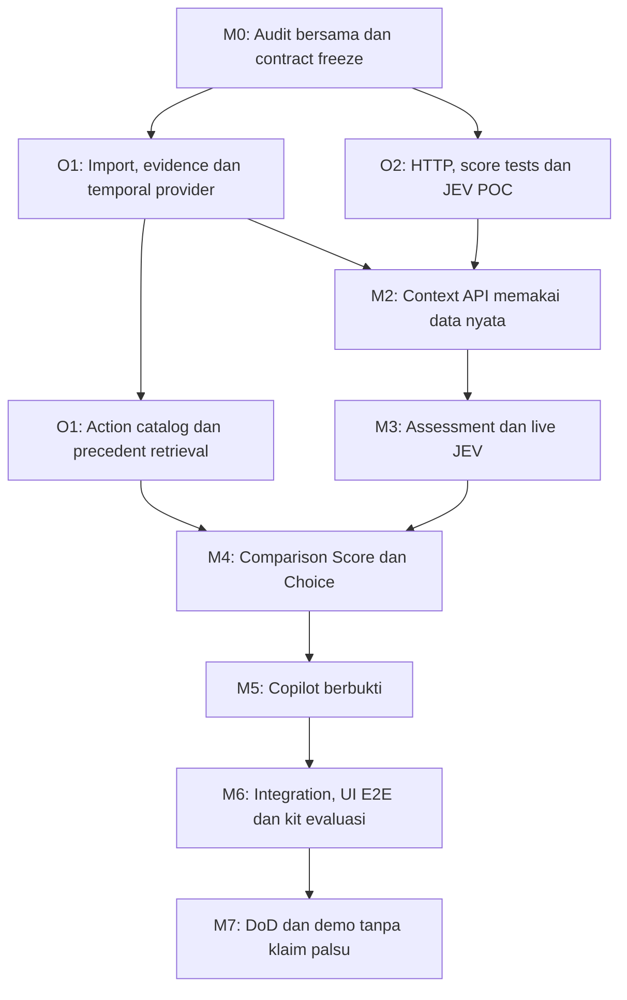

# Relio v1 — Rencana Pengembangan untuk Dua Orang

**Tanggal:** 9 Oktober 2026  
**Acuan:** [PRD Final MVP v1.0](../../Relio_PRD_Final_MVP_v1.0_Agent_Ready_ID.md) · [Arsitektur](architecture.md) · [Pertanyaan terbuka](open-questions.md).  
**Status:** Rencana kerja, bukan laporan pekerjaan selesai. Pembagian fokus ditetapkan user; nama file/interface dan mekanisme teknis di bawah adalah rancangan awal untuk dikonfirmasi pada M0.

## 1. Pembagian inti

| Orang | Fokus | Hasil yang harus disediakan |
|---|---|---|
| **O1 — Context Graph Developer** | Dataset, ETL, identity resolution, graph temporal, provenance/evidence, occurrence/catalog dan traversal. | Context repository/adapter yang menyediakan data serta query temporal tervalidasi bagi aplikasi. |
| **O2 — Backend Application Developer** | Go API, controllers/services, penilaian, JEV, action comparison, Copilot, keamanan dan operasi aplikasi. | REST API v1 yang menggunakan context O1, bukan membangun ulang join CSV sendiri. |

**Kalimat handoff:** O1 menjawab **“fakta, relasi, tindakan dan bukti apa yang tersedia pada tanggal ini?”**; O2 menjawab **“bagaimana fakta itu disajikan, dinilai, dibandingkan dan ditanyakan oleh pengguna?”**

Tidak perlu dua server/microservice hanya karena ada dua developer. Bekerja paralel melalui interface serta pembagian file; deployment/storage tetap keputusan Q01.

### Yang tidak berubah

- Go API dengan `main.go` di `backend/`; package `routes`, `controllers`, `services`, `repository`, `models` langsung di bawahnya.
- Unit utama Deal; perbandingan 2–4 tindakan berbukti, bukan action optimizer.
- JEV live diperlukan, bukan mock yang dianggap integrasi asli.
- Tidak mengarang tindakan, approval, consent, stage history, usage prospek atau outcome.
- Tidak melakukan commercial writes, approval baru atau otomatis membuat priority nol karena diskon ditolak.
- Unknown/null berbeda dari zero/false/resolved.

## 2. Batas scope dan gap frontend

Rencana ini membagi **pekerjaan context graph dan aplikasi backend**, sesuai fokus yang diminta. Graph visual frontend, timeline UI, score drawer, comparison UI dan E2E browser tetap P0 v1, tetapi belum diberikan owner pada pembagian ini.

**Keputusan M0 (Q29):** apakah frontend sudah dikerjakan pihak lain, tersedia di repositori lain, atau perlu slot pekerjaan tambahan salah satu dari dua orang setelah backend stabil? Jangan mengasumsikan ada developer ketiga. Jika hanya dua orang yang mengerjakan keseluruhan produk, alokasi frontend perlu disetujui tanpa menghapus P0 backend.

Sampai keputusan itu ada, rencana mencakup DTO/handoff dan API smoke test untuk UI, **bukan mengklaim MVP lengkap hanya karena API selesai**. Evaluasi A/B/C tidak mengganti kewajiban UI E2E.

## 3. Ownership komponen dan file

**Usulan penempatan**, bukan file yang dibuat pada tugas dokumentasi ini:

| Area | Penulis utama | Aturan batas |
|---|---|---|
| ETL/import script dan data-quality report | O1 | Python adalah default v1; runtime/lokasi final Q02/Q24. Import bukan upload endpoint publik. |
| Schema/index graph dan source/evidence store | O1 | Engine Q01; metadata/cache schema O2 dibahas bersama sebelum perubahan storage. |
| Graph/source domain model: nodes, edges, events, evidence, occurrence, template | O1 | File khusus di `backend/models/`; tidak mengubah DTO HTTP tanpa handoff. |
| Context read interface dan concrete graph/source adapter | O1 | File khusus di `backend/repository/`; O2 review kontrak, tidak menulis query alternatif. |
| `backend/repository/deal_repository.go` existing | O1 setelah kontrak disepakati | Implementasikan adapter yang memenuhi kontrak yang sudah ada; perubahan signature harus dikoordinasikan. |
| `backend/models/deal.go` existing dan DTO assessment/comparison/Copilot | O2 | Nullable fields/availability disepakati bersama O1; tidak mendefinisikan ulang source IDs. |
| `backend/main.go`, `backend/routes/`, `backend/controllers/` | O2 | O1 memberikan constructor/config adapter; O2 melakukan wiring HTTP. |
| `backend/services/deal_service.go`, context API services dan policy | O2 | Memakai data provider O1; tidak parsing sumber mentah untuk query aplikasi. |
| JevAdapter, model-output validator, assessment/comparison/Copilot services | O2 | Satu adapter untuk tim. O1 memasok evidence dan rule ekstraksi, bukan client vendor kedua. |
| Assessment/result cache repository dan application telemetry | O2 | Tidak memindahkan business/source schema tanpa koordinasi O1. |
| Graph/import/provider tests dan source fixtures | O1 | Fixture terisolasi dan DATA UJI. |
| HTTP/service/model/cache/security tests | O2 | Contract fixtures sebelum adapter nyata, lalu integration test dengan O1. |
| Ground-truth evidence/key kasus evaluasi | O1, direview O2 | Fakta dari sumber; jawaban JEV bukan ground truth. |
| Rubrik evaluasi independen, template hasil, metric script | O2, direview O1 | Rubrik bukan sekadar setuju dengan JEV. Tidak membuat angka peserta. |
| Shared contract/schema changes | Satu owner per artefak, review bersama | Pengubah menginformasikan consumer dan memperbarui contract test. |

Usulan file domain: `models/graph.go`, `models/event.go`, `models/evidence.go`, `models/action.go`; file interface/adapter: `repository/context_repository.go` dan adapter sesuai engine. Nama tersebut **belum ada sebagai implementasi** dan tidak wajib dipakai persis; tujuannya memisahkan write set.

Jika Python ETL dipilih, direktori script dapat berada di `backend/etl/`; itu script tooling, bukan package Go `internal/`/`cmd/`. Pilihan lokasi masih Q02. Jangan menambah package/proses baru tanpa kebutuhan.

## 4. Kontrak handoff sebelum bekerja paralel

### 4.1 H01 — Context query contract

O1 dan O2 harus menyepakati contract v1 sebelum migration/DTO bergantung padanya. Daftar operasi **semantik yang diusulkan**, bukan method Go yang sudah ada:

| Operasi | Context input | Keluaran yang dibutuhkan O2 |
|---|---|---|
| List deal facts | Snapshot, scope akses, filter yang disepakati. | Lima deal bila tersedia, fakta nullable/source/limitations; bukan score JEV dari repository. |
| Read deal context | Deal, snapshot dan dataset version. | Account/stakeholder, interaksi, gate/negotiation evidence, factual dimensions, unknowns. |
| Read graph | Deal/snapshot, depth/node budget, focus bila diperlukan. | Typed nodes/edges, evidence refs, event links, validity, truncation. |
| Read timeline | Deal/snapshot, type/actor/status, batas halaman. | Stable chronological events, actor/target, node/edge/evidence IDs. |
| Read evidence | Evidence ID + context snapshot/access terverifikasi. | Source record/field/span/date, safe excerpt, availability/scope. |
| Read action candidates | Deal/snapshot, relevance rule version. | Template, valid occurrences/preseden, source refs dan limitations; bukan fabricated options. |
| Read selected action evidence | Deal/snapshot + selected IDs. | Bundle masing-masing opsi dan prasyarat/policy facts; IDs tidak sekadar dipercayai dari browser. |
| Read dataset status | Active dataset/config. | Ready/partial/missing/error, version/checksum/limitations tanpa secret. |

Tidak wajib satu interface besar dengan semua operasi. Gunakan interface sekecil consumer perlu; pertahankan kontrak DealRepository yang ada sampai perubahan disepakati. Format Go dan query detail Q30.

### 4.2 H02 — Data envelope

Minimum contract:

- `deal_id`/scope, `as_of`, dataset/evidence/contract versions.
- Source record IDs canonical dan namespace Person Employee/Contact.
- Nullability, fakta current vs historical, `snapshot_only`, unknowns/ambiguity.
- Node/edge/event/action/evidence IDs yang saling menunjuk dengan benar.
- Event date, employment validity, source date dan provenance field/span.
- Negosiasi request/decision/contract links beserta scope dan verification.
- ActionTemplate/Occurrence dengan outcome nullable, analog precedent dan occurrence cutoff.
- Data coverage/truncation serta alasan status.

Nama version/envelope field final dibekukan bersama; tidak otomatis persis nama contoh dokumentasi. Bukti sumber bukan narasi LLM.

### 4.3 H03 — Error dan responsibility boundary

O1 membedakan source record tidak ada, tidak terlihat pada snapshot, data belum diimport, reference ambigu, dan query gagal. O2 menerjemahkan kategori ke HTTP/error contract yang aman, dengan access checking dan tanpa membocorkan secret/source terlarang.

O1 menjamin integrity ID/snapshot/provenance; O2 menjamin request bounds, server access, domain policy, model validation, response schema dan cache. Checks pertahanan berlapis boleh ada, tetapi jangan mendefinisikan rule cutoff/identity yang berbeda.

### 4.4 H04 — Bukti handoff

Setiap handoff membawa:

1. Schema/interface version dan perubahan dibanding versi sebelumnya.
2. Contoh output dari sumber nyata setelah provider tersedia, plus source IDs yang bisa diperiksa.
3. Contract test dan cara menjalankannya.
4. Kasus empty/ambiguous/historical/truncated beserta expected behavior.
5. Blocker yang belum selesai, khususnya data/API credentials.

Sebelum data adapter siap, O2 memakai fixtures **test-only** untuk controller/service. Jangan deploy fixture sebagai respons yang diklaim dataset kompetisi. Source/script/database dump saja belum cukup sebagai handoff tanpa cara query yang dapat diuji.

## 5. Backlog O1 — Context Graph

| ID | Pekerjaan | Output/acceptance | Dependency |
|---|---|---|---|
| G01 | Audit 11 sumber inti, README, kolom, row count, checksum dan FK. | Manifest dan data-quality report; missing/row errors tidak silently skipped. | Akses dataset, Q24. |
| G02 | Tetapkan canonical IDs, waktu, source/graph/action schema. | Schema/rule registry version; H01–H03 disepakati. | Q01, Q03–Q07, Q09, Q25, Q30. |
| G03 | Import entitas/structural edges. | Deal/account/contact/employee/contract mapping dan sumber terlacak. | G01–G02. |
| G04 | Evidence normalization. | Stable evidence IDs, field/span/date/excerpt, query snapshot-safe. | G01–G03, Q19. |
| G05 | Identity/employment resolution. | Valid-at-event identity; multiple match tetap ambiguous; tidak merge dari nama. | G02–G04, Q06. |
| G06 | Temporal graph provider. | Deal neighborhood/focus, validity, history, snapshot-only, bound/truncation. | G03–G05. |
| G07 | Timeline dan highlight mapping. | Event↔node/edge/evidence dua arah, sort stabil, filter. | G04–G06, Q18. |
| G08 | Decision/request/contract linkage. | Requested/approved/applied terpisah; tidak account approval blanket. | G04–G07, Q10. |
| G09 | Usage aggregate dan analogue context. | Account/month, cutoff/coverage, missing vs zero, source refs. | G01–G03, Q08. |
| G10 | ActionOccurrence/Template extraction. | Setiap template punya occurrence berbukti; offered tidak menjadi completed; dedup. | G04–G08, Q25. |
| G11 | Candidate/precedent retrieval. | Relevance dengan alasan/version, historical cutoff, <2 kandidat jujur, valid paths. | G10, Q26/Q28. |
| G12 | Idempotency, temporal, evidence dan performance tests. | Dua import konsisten, source references valid, benchmark dan limitations dicatat. | Berjalan sejak G03, seluruh provider. |
| G13 | Gold factual cases dan handoff akhir. | Expected IDs/paths P01–P05, 10%→14% isolated fixture, evaluation answer key. | G04–G12, review O2. |

### Definition of Done O1

- [ ] Dataset asli dapat diimport ulang tanpa duplicate node/edge/event/usage.
- [ ] Setiap klaim graph/action memiliki source record/field/span yang tepat.
- [ ] Query historical tidak memasukkan event, attribute atau preseden future.
- [ ] Employment dan email ambiguity ditangani tanpa tebakan.
- [ ] P01–P05 menggunakan deal ID nyata; P05 unknown bukan penilaian negatif.
- [ ] Usage existing tidak ditempel ke prospek sebagai usage langsung.
- [ ] Katalog tidak mengandung tindakan tanpa occurrence; jumlah candidate aktual dilaporkan.
- [ ] Context API contract dan integration tests dapat dipakai O2.
- [ ] Report data quality, benchmark yang benar-benar diukur dan blocker tersedia.

G10 tidak berarti LLM wajib membangun semua edges. Struktur dari IDs deterministik; semantic action/gate extraction harus memiliki quote dan rule/validation. Bila butuh JEV, gunakan adapter O2 dan koordinasikan dependency, jangan mengarang label demi menyelesaikan G10.

## 6. Backlog O2 — Aplikasi Backend

| ID | Pekerjaan | Output/acceptance | Dependency |
|---|---|---|---|
| B01 | Audit Go/toolchain/scaffold, config dan baseline test. | Status aktual, bukan klaim test dari diagnostics editor. | Akses environment. |
| B02 | Bekukan DTO/OpenAPI, null/error/snapshot dan handoff. | Route v1 dan H01–H03 dapat diuji dengan contract fixtures. | M0 bersama, Q18–Q20/Q30. |
| B03 | Routes/controllers/context services. | `/deals`, detail, `/graph`, `/timeline`, `/evidence`, health terhadap interface. | B02; G06–G07 untuk real data. |
| B04 | Request/access validation dan response consistency. | Invalid date/ID, unauthorized scope, depth/body bounds, stale context diuji. | B02–B03, Q03/Q18–Q22. |
| B05 | Deterministic assessment. | ACV 50/50, urgency known-only, default 7 hari, lima coverage dims; explanations. | Facts G03–G09, Q11–Q14. |
| B06 | POC dan live JevAdapter. | Official contract verified, type-safe questions, authenticated result bukan mock. | Credential Q15; POC dimulai M0. |
| B07 | Model validator, status, metadata dan cache. | Schema+evidence validation, distributions/ranges, input-hash/version/snapshot key, bounded retries. | B05–B06, Q16/Q20/Q22. |
| B08 | Action candidates endpoint dan comparison. | 2–4 opsi unique/valid; Score tiap opsi, Choice set, ranking/partial/policy/unknowns. | G10–G11, B06–B07, Q25–Q28. |
| B09 | Copilot grounded Q&A. | Lima parafrasa, citation/path check, abstention, safe history/snapshot/access. | G04/G06/G11, B07, Q17/Q19/Q21. |
| B10 | Demo access, secrets, health/readiness dan cost protection. | Tidak unrestricted paid proxy; config ≠ verified; safe errors/logs/limits. | Q21–Q24, B04/B07. |
| B11 | HTTP/service/integration/performance smoke tests. | Report pass/fail aktual dengan provider O1; live JEV test terpisah mock. | B03–B10 dan source handoff. |
| B12 | Experiment kit dan metric harness. | Tasks/rubric/template/limitations, script menghitung hanya hasil yang diisi. | G13, Q29; review independen rubrik. |
| B13 | Runbook dan frontend integration handoff. | Install/import/run/env/curl, schema examples, errors/loading/version; UI owner jelas. | B11–B12, G12–G13, Q29/Q30. |

### Definition of Done O2

- [ ] Route v1 berjalan menggunakan provider nyata, bukan fixture disguised.
- [ ] HTTP DTO membedakan null/zero, insufficient evidence dan provider failure.
- [ ] Deterministic scores reproducible dan rubric/version/source terlihat.
- [ ] JEV live berhasil, divalidasi, tercatat aman, dan failure tidak menjadi sukses palsu.
- [ ] Comparison memakai 2–4 opsi yang valid pada snapshot; tidak membuat opsi tambahan.
- [ ] Score/Choice berbeda makna dan cache tidak dipakai untuk set aksi lain.
- [ ] Policy approval/reference tidak diklaim tanpa bukti scope yang cocok.
- [ ] Copilot memiliki citations/unknowns dan tidak membocorkan future lewat history.
- [ ] Model/evidence endpoints dilindungi sesuai deployment; secret tidak bocor.
- [ ] Integration report, runbook dan experiment kit tersedia.

B06 punya dua gerbang: **POC koneksi/contract** boleh memakai input uji berlabel untuk mengurangi risiko awal, tetapi **acceptance MVP** tetap membutuhkan bundle hasil retrieval graph/data asli serta live JEV sesuai v1. Jangan menyamakan keduanya.

## 7. Milestone dan pekerjaan paralel

Tidak diberi tanggal/jam pasti karena deadline, kapasitas dan environment belum diketahui. Urutan menggunakan exit gate; estimasi kalender dibuat setelah M0.

| Milestone | O1 mengerjakan | O2 mengerjakan | Output dan exit gate |
|---|---|---|---|
| **M0 — Audit dan kontrak** | G01–G02; cek schema, storage dan sampel bukti. | B01–B02; mulai B06 POC, credential/provider check. | H01–H03, ID/time/null/schema basics dan ownership disepakati; Q29 frontend dicatat. |
| **M1 — Fondasi paralel** | G03–G05, mulai G09/G10 setelah source mapping. | B03–B04 terhadap fixtures test-only, B05 unit rules. | Structural graph/evidence import konsisten; app contract tests lulus pada environment tim. |
| **M2 — Vertical slice nyata** | G06–G08 untuk satu deal, lalu seluruh lima deal. | Wire provider pada B03; actual deal/graph/timeline/evidence/health. | Pilih deal dan cutoff, source bisa ditelusuri, no future leakage. Fixture tidak jadi data demo. |
| **M3 — Assessment live** | Evidence/coverage/negotiation bundles dan ambiguity kasus. | B05–B07, integration JEV dari retrieved evidence. | Deterministic+JEV terpisah, status/cache/version benar, provider errors terlihat. |
| **M4 — Action comparison** | G10–G11, candidate relevansi/preseden/policy facts. | B08 dengan Score/Choice dan request validation. | Bandingkan dua opsi nyata jika tersedia; insufficient-options dan set validation teruji. |
| **M5 — Copilot** | Retrieval/path dan gold factual cases G13. | B09–B10 grounded answers, history/access guardrails. | Lima parafrasa/abstention/citations, perubahan tanggal tidak membawa future history. |
| **M6 — Integration dan evaluasi** | G12–G13 source accuracy/reimport/perf dan answer key. | B11–B13 API checks/metric kit/runbook, dukungan UI owner. | Report aktual, A/B/C kit lengkap, UI graph/comparison/Copilot E2E dilaksanakan oleh owner yang disepakati. |
| **M7 — Demo siap** | Rebuild snapshot dan validasi evidence terakhir. | Security/loading/error final dan deployment/demo integration. | Acceptance §12; daftar fitur, pass/fail, limitations dan blocker eksplisit. |

M1–M3 dapat overlap setelah contract dasar dibekukan. O1 tidak perlu menunggu semua assessment selesai untuk mengekstrak occurrence; O2 tidak perlu menunggu semua usage/customer graph untuk menguji parser request/rumus/client JEV.

### Critical path

Kontrak waktu/ID → minimal graph/evidence nyata → context API → live assessment → comparison valid → Copilot → UI E2E/acceptance. Credential JEV, dataset dan ownership frontend adalah risiko yang diverifikasi **sejak M0**, bukan di akhir jalur.

## 8. Urutan integrasi praktis

1. **Slice pertama:** pilih satu deal dengan sumber yang memang tersedia; O1 menyediakan graph/timeline/evidence, O2 membuat endpoint dengan ID/source yang sama. Jangan hardcode hasil kasus.
2. **Temporal slice:** ubah `as_of`, cek employment, current stage historical unknown, evidence dan response lama. Tambahkan P05 empty state.
3. **Score slice:** tambah attractiveness/urgency/coverage dari data yang tersedia; readiness live JEV tervalidasi.
4. **Action slice:** daftar candidate, pilih 2–4, validate selected IDs pada snapshot, Score per opsi dan Choice set, highlight occurrence sumber.
5. **Copilot slice:** retrieval bundle sama; jawaban mengutip source yang bisa dibuka.
6. **All-deal regression:** P01–P05, ulang import, negative cases dan benchmark.
7. **UI/evaluation:** frontend state dan visual callbacks diuji nyata; kit A/B/C menggunakan key manual, bukan jawaban model.

Tidak memakai folder dataset langsung dari controller/service request. Import menyediakan data yang dapat di-query; aplikasi tidak mengulang ETL pada setiap request/server restart tanpa keputusan eksplisit.

## 9. Contract/integration test bersama

| Kasus | O1 menjamin | O2 menjamin |
|---|---|---|
| Account vs Deal | P01→deal asli; account-only context berlabel. | Route dan assessment tidak menyamakan kedua ID. |
| Email historis | Identity berdasarkan event-time dan ambiguity terjaga. | UI DTO/Copilot tidak mengubah ambiguity menjadi fakta. |
| Future event/source | Provider tidak mengembalikan data future, termasuk occurrence/candidate. | Evidence/model input/cache/history mengikuti snapshot sama. |
| Current stage lampau | Snapshot-only/unknown, tanpa stage history karangan. | Summary/score tidak memakai current stage seolah diketahui historis. |
| Diskon 10%→14% | Fixture terisolasi, request/decision/contract scope terpisah. | 14% memerlukan approval, tidak memakai approval 10% otomatis. |
| Reference consent | Bukti atau unknown, analogue berlabel. | Suitability/ranking bukan permission/reference siap pakai. |
| <2 action valid | Candidate aktual 0/1 tanpa padding. | Comparison ditolak/insufficient sesuai kontrak, tidak memanggil model untuk opsi rekaan. |
| Unknown/duplicate action IDs | Lookup valid set/scope pada snapshot. | Body constraints 2–4 distinct, retry/cache/policy konsisten. |
| Score vs Choice | Bukti opsi tetap stabil dan jelas. | Display/rank disagreement tidak dipaksa konsensus; Choice relative set. |
| JEV down/invalid output | Facts/evidence tersedia bila dataset sehat. | Deterministic facts tetap valid, JEV unavailable, bukan mocked success. |
| Reimport/rubric berubah | Version/provenance/rebuild dapat dilacak. | Cache invalidated, response tidak dilabeli version baru secara palsu. |
| Chat lalu mundur tanggal/ganti user | Retrieval baru snapshot/access-correct. | History lama tidak menjadi evidence baru atau bocor lintas user. |

Unit tests dapat memakai fixture. Integration positive path menggunakan provider/dataset nyata; live JEV acceptance terpisah. UI E2E memerlukan aplikasi frontend nyata, bukan hanya curl/HTTP smoke test.

## 10. Experiment kit A/B/C

| Artefak target v1 | Penulis utama usulan | Review |
|---|---|---|
| `evaluation/tasks.md` | O1: pertanyaan faktual dan action/policy cases. | O2: kesulitan setara dan variasi parafrasa. |
| `evaluation/answer_key.md` | O1: source IDs/paths dan unknowns yang benar. | O2: audit independence dari output JEV. |
| `evaluation/score_rubric.md` | O2: evidence/relevance/policy/uncertainty rubric. | O1: cocok dengan fakta dan batas sumber. |
| `evaluation/results_template.csv` | O2. | Bersama: condition, case, participant, duration dan penilaian. |
| `scripts/evaluate_results.*` | O2. | O1: sample input berlabel dan metric correctness. |
| `evaluation/limitations.md` | Bersama, satu penulis final ditetapkan M0. | Data kecil, participant count, scope dan method limitations. |

Lokasi relatif final dicatat di runbook; path di atas mengikuti artefak semantik PRD, bukan file yang sudah dibuat oleh tugas dokumentasi ini.

Kondisi A: CRM/CSV tanpa graph/JEV; B: graph/timeline/evidence tanpa penilaian JEV/comparison JEV; C: fitur graph+JEV+comparison. Harness menjaga pemisahan kondisi, bukan memberi Sales slider bobot atau mengganti scope aplikasi.

Gunakan 6–10 kasus dan kunci manual sebelum uji, counterbalanced order bila peserta mencoba beberapa kondisi. Metric script hanya menghitung hasil yang benar-benar diisi; empty template tidak menghasilkan klaim eksperimen selesai. Pengumpulan peserta tergantung waktu, bukan alasan memalsukan accuracy/time/win-rate.

## 11. Koordinasi dan keputusan yang perlu ditutup

### Sebelum M1

- Q01/Q02: storage, runtime importer, framework existing/default bersyarat.
- Q03–Q07/Q09: waktu, snapshot-only, identity, stable ID, schema dasar.
- Q19/Q24/Q30: safe evidence, dataset publish/version dan handoff ownership.
- Q15: akses/API JEV dicek paralel; credential blocker dilaporkan.
- Q29: owner UI/E2E serta experiment artefacts jelas.

### Sebelum M3–M4

- Q10–Q14: scope approval/requirement, historical denominator, boundary tujuh hari, known coverage criteria dan readiness label mapping.
- Q16/Q20: schema/evidence validation, model failure, cache/version/async.
- Q25–Q28: ActionTemplate/Occurrence, candidate rules, ranking/partial, requires-validation/policy.

### Sebelum exposure/demo

- Q17/Q21/Q22: Copilot provider/history, server access, biaya/secret/data policy.
- Q18/Q23/Q24: error/DTO final, report nyata, health/deployment/runbook.

Setiap milestone melakukan handoff singkat: versi contract, hasil nyata, tests yang dijalankan, blocker, perubahan consumer. Jika mengubah shared model/interface, satu orang menulis perubahan dan lainnya review; jangan mengedit shared file bersamaan tanpa pembagian.

## 12. Risiko dan respons

| Risiko | Respons |
|---|---|
| O2 menunggu graph lengkap | Bekukan contract awal, fixtures test-only, integrasikan satu vertical slice data nyata lebih dahulu. |
| O1 butuh penilaian semantik sebelum adapter O2 siap | Import struktur/source lebih dulu; koordinasikan shared evaluator POC; jangan isi label rekaan. |
| Candidate valid tidak mencapai dua | Tampilkan ketidakcukupan, test graceful failure; jangan membuat action supaya demo terlihat lengkap. |
| JEV key/API tidak tersedia | Kerjakan bagian deterministik/interface/error tests, laporkan blocker; jangan menyebut MVP complete. |
| Konflik shared models/repository | Owner file disepakati, versioned contract dan contract test bersama. |
| Graph query membengkak | Index/traversal bounds/truncation dengan sumber tetap jelas; ukur target p95, jangan klaim tanpa benchmark. |
| Belum ada owner frontend | Putuskan Q29 M0; UI P0 bukan tugas yang hilang atau otomatis selesai oleh backend. |
| Waktu hackathon terbatas | Utamakan seluruh P0 vertical slice; tunda enrichment opsional, bukan live JEV/evidence/validation/comparison wajib. |

## 13. Checklist kickoff

- [ ] O1/O2 ditentukan namanya tanpa mengubah fokus yang diminta.
- [ ] Deadline/kapasitas kerja dikonfirmasi sebelum estimasi kalender.
- [ ] Dataset tersedia dan kamus `READMEHack.md` diklarifikasi.
- [ ] Graph engine/import runtime diputuskan atau spike feasibility dijadwalkan.
- [ ] H01–H03, null/snapshot/ID rules dan owner shared files dibekukan.
- [ ] JEV credential/contract POC punya owner O2 dan blocker jelas.
- [ ] Kebutuhan UI/E2E punya owner/rencana yang disepakati.
- [ ] Test-only fixtures terpisah dari data riil.
- [ ] Milestone M0–M7 dan gate digunakan untuk handoff.

**Status saat dibuat:** checklist dan backlog belum dieksekusi melalui tugas dokumentasi ini. Tidak ada runtime, migration, import, model call, atau hasil test baru yang diklaim selesai.
